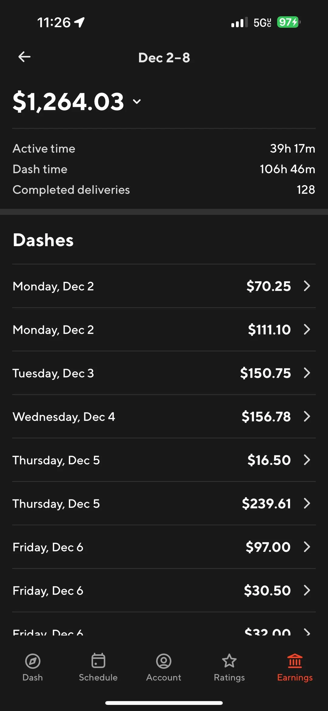
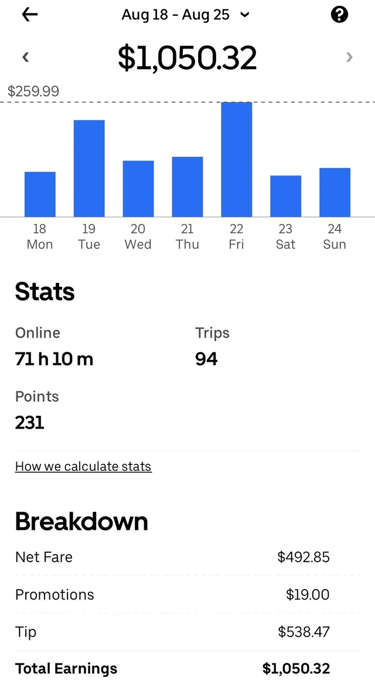
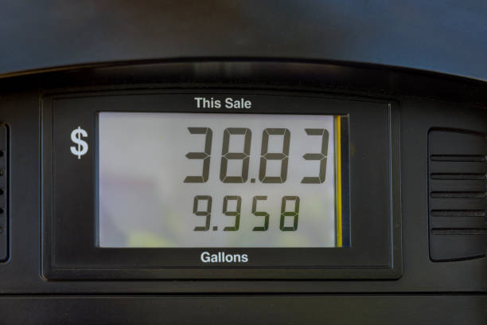

# Finance Tracker

A React Native / Expo app written in TypeScript for gig workers to track income, expenses, and earnings. Turn DoorDash and Uber Eats summaries or receipt photos into editable transactions, keep records locally with SQLite, and see how expenses affect take-home revenue.

## Features

- **Income and expense entry:** add transactions manually, review scanned values before saving, and edit or delete existing records.
- **Local persistence:** transactions are stored in an on-device SQLite database (`finance.db`) and survive app restarts. No account or backend is required.
- **Transaction history:** filter by income/expense and category, and sort by newest or oldest.
- **Gig summary scanning:** extract DoorDash revenue, dash time, deliveries, and mileage when present; extract Uber Eats earnings, online time, and trips. Combine values from multiple selected images.
- **Receipt OCR:** use on-device ML Kit text recognition to extract receipt totals, with manual correction available before saving.
- **Business expenses:** categorize gas, maintenance, food, tolls, tax, and other expenses, and mark expenses as business-related.
- **Earnings analytics:** view income, expenses, hours, deliveries, fuel, mileage, net revenue, and hourly net revenue.

The dashboard calculates **net revenue = income − all expenses**. **Hourly delivery net revenue = (DoorDash + Uber Eats income − marked business expenses) ÷ recorded delivery hours**, showing zero when no hours are recorded. DoorDash uses dash time and Uber Eats uses online time. Other income is excluded from the hourly rate but remains in total and net revenue. Mark only delivery-work expenses as business expenses for this calculation; expenses are not allocated to individual platforms.

## Scan examples

These existing sample inputs illustrate the images used by the scanning flow.

| DoorDash summary | Uber Eats summary | Fuel reference |
| --- | --- | --- |
|  |  |  |

## Technology

| Layer | Technology |
| --- | --- |
| Application | React Native 0.86, React 19.2, TypeScript 6 |
| Native tooling | Expo SDK 57, Expo development client |
| Navigation | Expo Router with file-based routes |
| Storage | `expo-sqlite`, SQL initialization and migrations |
| Image input | `expo-image-picker` |
| Text recognition | ML Kit through `@infinitered/react-native-mlkit-text-recognition` |
| Shared state | React Context and hooks |

## Architecture

```text
src/
  app/          Expo Router screens: home, history, finances, scan, edit
  components/   Dashboard, scanning UI, and reusable controls
  context/      FinanceProvider: shared transactions, mutations, totals
  database/     SQLite initialization, migrations, and transaction queries
  services/     Platform-specific OCR and scan orchestration
  utils/        DoorDash, Uber Eats, and receipt text parsers
  types/        Transaction and scan-draft types
```

The root layout initializes SQLite and provides finance state to the screens. Image selection feeds OCR, then a format-specific parser creates a transaction draft. After review, the provider saves it through the database layer and updates history and dashboard totals. Parsers are kept separate from image recognition and UI code.

## Future improvements

- Add app screenshots or a short walkthrough showing entry, history, filtering, and analytics.
- Expand OCR parser tests across receipt formats and changing delivery-platform layouts.
- Add duplicate-scan detection and clearer feedback for uncertain extracted values.
- Add date-range analytics, earnings trends, and per-platform comparisons.
- Add CSV export and backup/restore for locally stored records.

## License

See [LICENSE](LICENSE).
